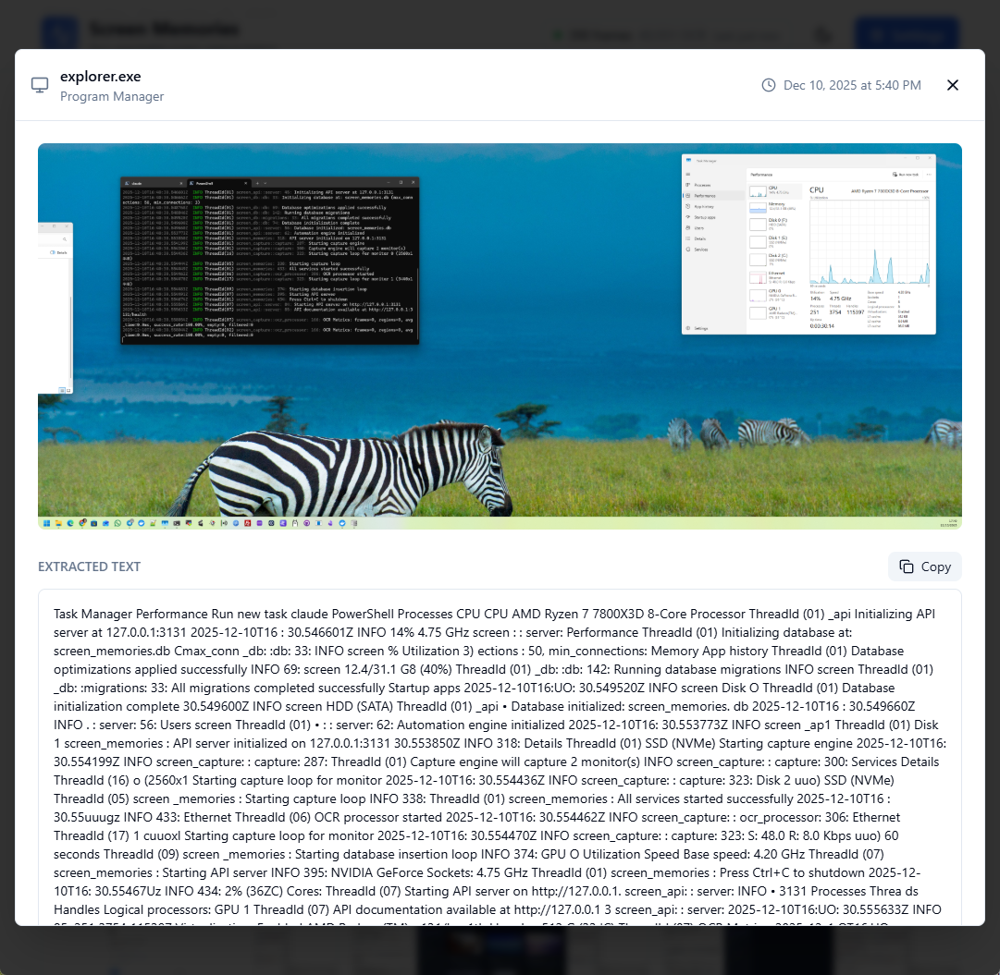
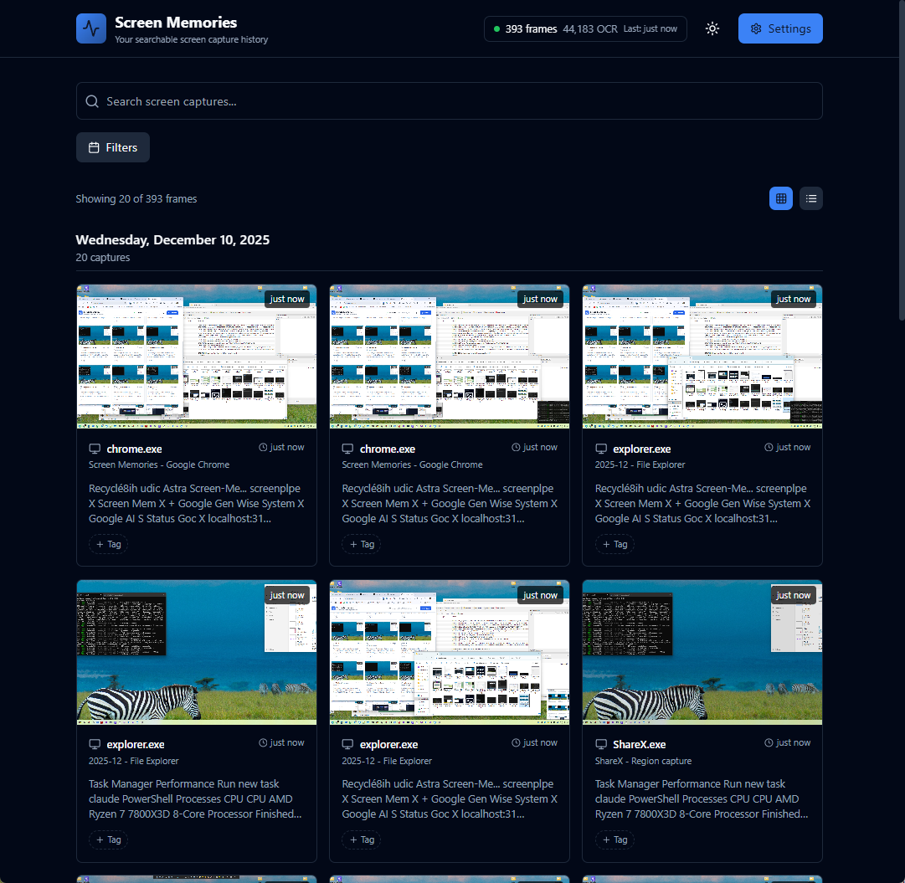
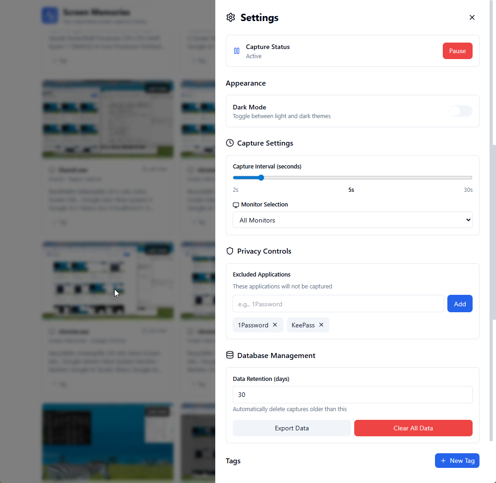
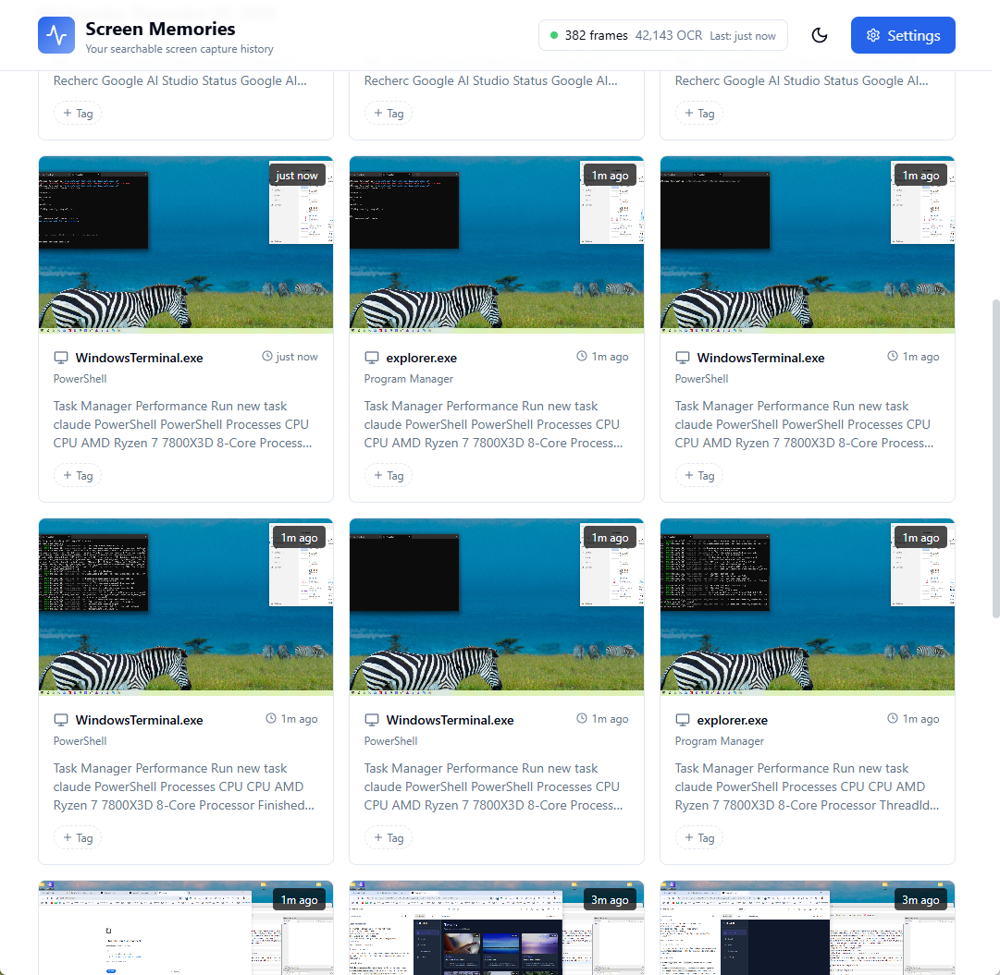
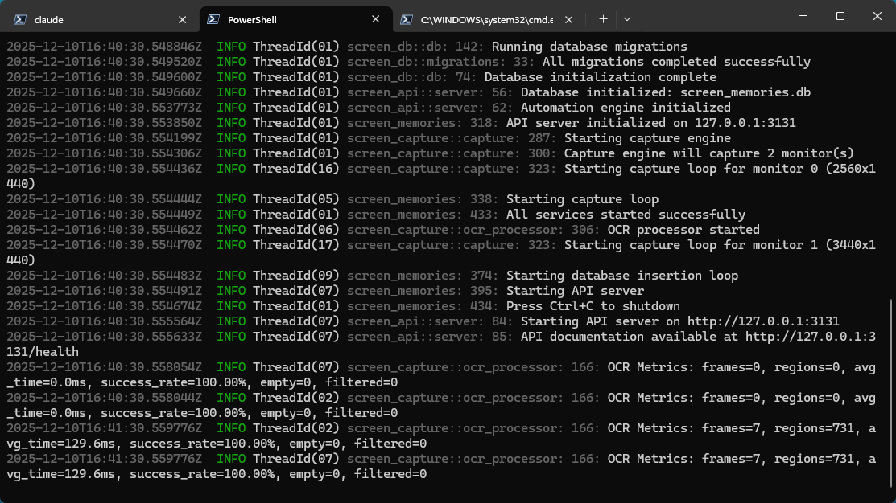

<div align="center">

```
   _____                           _____                     _     
  / ____|                         / ____|                   | |    
 | (___   ___ _ __ ___  ___ _ __ | (___   ___  __ _ _ __ ___| |__  
  \___ \ / __| '__/ _ \/ _ \ '_ \ \___ \ / _ \/ _` | '__/ __| '_ \ 
  ____) | (__| | |  __/  __/ | | |____) |  __/ (_| | | | (__| | | |
 |_____/ \___|_|  \___|\___|_| |_|_____/ \___|\__,_|_|  \___|_| |_|
                                                                   
                                                                   
```

### Your screen history, searchable and automated

*Continuously capture your Windows screen, extract text with OCR, and query it all through a powerful REST API*

[](https://opensource.org/licenses/MIT)
[](https://www.rust-lang.org)
[](https://www.microsoft.com)

<br/>

### [>] [**Download Latest Release (v0.2.0)**](https://github.com/nicolasestrem/screensearch/releases/latest)

**Windows 10/11** • **Professional Installer** • **Portable Option Available**

**📥 [Click here to download](https://github.com/nicolasestrem/screensearch/releases/latest)** • Then scroll to "Assets" section and download the Full Installer

</div>

---

```
┌─────────────────────────────────────────────────────────────────┐
│                      SEE IT IN ACTION                           │
└─────────────────────────────────────────────────────────────────┘
```

<div align="center">
  
  <p><em>Capture everything happening on your screen with intelligent frame differencing</em></p>
</div>

---

```
┌─────────────────────────────────────────────────────────────────┐
│                        KEY FEATURES                             │
└─────────────────────────────────────────────────────────────────┘
```

- [*] **Continuous Screen Capture** — Configurable intervals (2-5 seconds) with multi-monitor support
- [*] **OCR Text Extraction** — Windows OCR API with bounding box coordinates and confidence scores
- [*] **AI-Powered Intelligence** — Generate insights from your screen history using local LLMs (Ollama, LM Studio) or cloud providers (OpenAI)
- [*] **Hybrid Search** — Combines FTS5 (Sparse) and Vector Embeddings (Dense) for semantic understanding
- [*] **REST API** — 27 endpoints for search, automation, and tag management on localhost:3131
- [*] **UI Automation** — Programmatic control of Windows applications via accessibility APIs
- [*] **System Tray** — unobtrusive background operation with quick access menu
- [*] **Privacy Controls** — Exclude sensitive applications, pause on screen lock
- [*] **High Performance** — Optimized for modern multi-core processors with < 100ms API response times

---

```
┌─────────────────────────────────────────────────────────────────┐
│                    PROJECT INFORMATION                          │
└─────────────────────────────────────────────────────────────────┘
```

- **Website**: [screensearch.app](https://screensearch.app)
- **Repository**: [github.com/nicolasestrem/screensearch](https://github.com/nicolasestrem/screensearch)
- **Author**: Nicolas Estrem
- **License**: MIT
- **Platform**: Windows 10/11 only

---

```
┌─────────────────────────────────────────────────────────────────┐
│                     FEATURE HIGHLIGHTS                          │
└─────────────────────────────────────────────────────────────────┘
```

### [>] Timeline View — Browse Your Screen History

Visualize your day at a glance with the **Activity Graph**, showing exactly when you were most active. Browse your captured history in an elegant grid layout, filter by application, or jump to specific moments.

<div align="center">
  
  <p><em>Interactive density graph and frame grid for intuitive browsing</em></p>
</div>

### [>] Settings & Privacy Controls

Take full control of your capture experience. Configure capture intervals, select which monitors to capture, exclude sensitive applications, and manage your data retention.

<div align="center">
  
  <p><em>Comprehensive settings for customizing capture behavior and privacy</em></p>
</div>

### [>] Captured Frames Gallery

View your complete screen capture history organized by timestamp. Each frame is searchable and tagged.

<div align="center">
  
  <p><em>Browse, search, and organize your captured screen moments</em></p>
</div>

### [>] Intelligence Dashboard — AI That Understands Your Work

Transform raw screen captures into actionable insights. The Intelligence dashboard connects to your choice of AI provider—local models like Ollama and LM Studio for privacy, or cloud services like OpenAI for power.

**What It Does:**
- [*] **Daily & Weekly Reports** — Automatic summaries of your work patterns and productivity
- [*] **Custom Queries** — Ask specific questions about your activity history
- [*] **Provider Flexibility** — Works with any OpenAI-compatible API endpoint
- [*] **Privacy First** — Local LLMs keep all analysis on your machine

<div align="center">
  
  <p><em>AI-powered analysis of your screen activity—test connections, generate reports, and export insights</em></p>
</div>

### [>] Terminal Integration

Powerful logging and diagnostics. Watch ScreenSearch initialize, start capture loops, and process OCR in real-time.

<div align="center">
  
  <p><em>Real-time logging with performance metrics and system health checks</em></p>
</div>

---

```
┌─────────────────────────────────────────────────────────────────┐
│                     DOWNLOAD & INSTALL                          │
└─────────────────────────────────────────────────────────────────┘
```

### For End Users (Recommended)

**Step 1: Download**
1. Go to the [Latest Release](https://github.com/nicolasestrem/screensearch/releases/latest)
2. Scroll down to the **Assets** section (below the release notes)
3. Click on `ScreenSearch-v0.2.0-Setup-Full.exe` to download

**Step 2: Install**
1. Run the downloaded `.exe` file
2. **Important**: When Windows SmartScreen appears, click **"More info"** → **"Run anyway"**
   - This is normal for self-signed applications
3. Follow the installation wizard
4. Launch ScreenSearch from the Start Menu
5. Access the web interface at `http://localhost:3131`

That's it! ScreenSearch will start capturing your screen automatically.

---

```
┌─────────────────────────────────────────────────────────────────┐
│                 BUILD FROM SOURCE (DEVELOPERS)                  │
└─────────────────────────────────────────────────────────────────┘
```

### Prerequisites

- **Windows 10/11** — Ensure Windows OCR Language Pack is installed (Settings → Language → English)
- **Rust 1.70+** — Install from [rustup.rs](https://rustup.rs/)
- **Visual Studio Build Tools** — Required for native compilation ([download](https://visualstudio.microsoft.com/downloads/))
- **Node.js 18+** — For the web UI (optional, only if using the dashboard)

### Installation & Setup

```bash
# Clone the repository
git clone https://github.com/nicolasestrem/screensearch.git
cd screensearch

# Build the project
cargo build --release

# Run ScreenSearch (starts API on localhost:3131)
cargo run --release
```

### [>] Web Dashboard

Launch the beautiful web interface to visualize and manage your captures:

```bash
cd screen-ui
npm install
npm run dev
# Open http://localhost:5173 in your browser
```

**Dashboard Features**:
- [*] Timeline view of captured frames with real-time thumbnails
- [*] Full-text search across all OCR content
- [*] Intelligence tab with AI-powered report generation
- [*] Frame details with OCR text, tags, and metadata
- [*] Live settings configuration and privacy controls
- [*] Dark mode for comfortable late-night browsing

---

```
┌─────────────────────────────────────────────────────────────────┐
│                      SECURITY & TRUST                           │
└─────────────────────────────────────────────────────────────────┘
```

### Windows SmartScreen Warning

On first launch, Windows may display a SmartScreen warning:
> "Windows protected your PC - Unknown publisher"

**This is expected behavior** because the executable is not code-signed with a certificate (which requires an expensive annual subscription).

**To run the application:**
1. Click **"More info"**
2. Click **"Run anyway"**

### Binary Verification

You can verify the safety of the binary:

- **VirusTotal Scans:**
  - [EXE Scan Results](https://www.virustotal.com/gui/file/807707d80a0886dd635e8cfbcb96d8670c2531176d248206decd248c00961eb0/detection) - 0/72 detections [OK]
  - [ZIP Scan Results](https://www.virustotal.com/gui/file/6b3c93398cf3c720da3e9c88a58bce93e9a9ee016819a9ab26005ef6bde90003) - 0/68 detections [OK]
- **Open Source:** All source code is available in this repository for review
- **Build From Source:** Follow the [Developer Guide](docs/developer-guide.md) to compile yourself

---

```
┌─────────────────────────────────────────────────────────────────┐
│                       DOCUMENTATION                             │
└─────────────────────────────────────────────────────────────────┘
```

| Document | Purpose |
|----------|---------|
| [User Guide](docs/user-guide.md) | Installation, configuration, and everyday usage |
| [Developer Guide](docs/developer-guide.md) | Development setup, workflow, and contribution guidelines |
| [Architecture](docs/architecture.md) | System design, data flow, and technical decisions |
| [API Reference](docs/api-reference.md) | Complete REST API endpoint documentation with examples |
| [Commands Summary](docs/commands-summary.md) | Quick reference for CLI commands and workflows |
| [Testing](docs/testing.md) | Test protocols, coverage reports, and CI/CD pipelines |

```
┌─────────────────────────────────────────────────────────────────┐
│                     PROJECT STRUCTURE                           │
└─────────────────────────────────────────────────────────────────┘
```

```
screensearch/
├── src/main.rs                 # Application entry point and orchestration
├── screen-capture/             # Screen capture engine and OCR pipeline
│   ├── src/capture.rs         # Frame capture with ffmpeg-sidecar
│   ├── src/ocr.rs             # Windows OCR API integration
│   └── src/frame_diff.rs       # Zero-copy frame differencing
├── screen-db/                  # SQLite database with FTS5 search
│   ├── src/queries.rs         # SQL queries and migrations
│   └── src/migrations/        # Schema versioning
├── screen-api/                 # REST API server (Axum framework)
│   ├── src/routes.rs          # API endpoint definitions
│   ├── src/handlers/          # Request handlers
│   │   ├── ai.rs              # AI intelligence endpoints
│   │   └── ...                # Other handlers
├── screen-automation/          # Windows UI automation engine
│   ├── src/engine.rs          # Automation orchestration
│   └── src/element.rs         # Element detection and interaction
├── screen-ui/                  # Modern React web dashboard
│   ├── src/components/        # UI components (Timeline, Search, Settings)
│   ├── src/pages/             # Main pages (Intelligence, Timeline)
│   └── src/api/               # Frontend API client (including AI endpoints)
├── screenshots/                # README screenshots
├── docs/                       # Complete documentation
└── config.toml                 # Configuration and build settings
```

---

```
┌─────────────────────────────────────────────────────────────────┐
│                    PERFORMANCE METRICS                          │
└─────────────────────────────────────────────────────────────────┘
```

ScreenSearch is optimized for efficiency and speed:

| Metric | Target | Actual | Status |
|--------|--------|--------|--------|
| **OCR Processing** | < 100 ms | **70-80 ms** | [OK] Fast |
| **API Response** | < 100 ms | ~50 ms | [OK] 2x faster |
| **Vector Search** | < 200 ms | **150 ms** | [OK] In-Memory Optimized |
| **Test Coverage** | 100% | 59/59 passing | [OK] Complete |

### Recent Performance Optimizations

**[+] Zero-Copy OCR Pipeline** — Direct `SoftwareBitmap` creation eliminates PNG encoding/decoding overhead, saving **60-93ms per frame** (53% faster). Enables 1-second capture intervals.

**[+] Memory Efficiency** — Arc-based frame differencing eliminates redundant allocations, reducing memory pressure from **39GB/8hr → <1GB/8hr**.

**[+] Storage Optimization** — 50x reducution in storage usage via smart JPEG compression and resizing. Automatic 24h cleanup loop enforces retention policies.

**[+] Search Security** — FTS5 query sanitization prevents injection attacks while correctly handling special characters (`C++`, `$100`, etc.).

**[+] In-Memory Vector Search** — Bypasses SQLite extension limitations by effectively managing embeddings in Rust memory, enabling robust semantic search on Windows.

---

```
┌─────────────────────────────────────────────────────────────────┐
│                    API QUICK EXAMPLES                           │
└─────────────────────────────────────────────────────────────────┘
```

### Search Your Screen History

```bash
# Search for any text captured on your screen
curl "http://localhost:3131/search?q=meeting&limit=10"

# Search with filters (timestamp, application name, etc.)
curl "http://localhost:3131/search?q=meeting&app=Chrome&start=2025-12-10"
```

### Generate AI Intelligence Reports

```bash
# Test your AI provider connection
curl -X POST http://localhost:3131/ai/validate \
  -H "Content-Type: application/json" \
  -d '{"provider_url":"http://localhost:11434/v1","model":"llama3"}'

# Generate a daily activity summary
curl -X POST http://localhost:3131/ai/generate \
  -H "Content-Type: application/json" \
  -d '{
    "provider_url": "http://localhost:11434/v1",
    "model": "llama3",
    "start_time": "2025-12-10T00:00:00Z",
    "end_time": "2025-12-11T00:00:00Z",
    "prompt": "Summarize my work activity"
  }'
```

### Automate Desktop Interactions

```bash
# Click at specific coordinates
curl -X POST http://localhost:3131/automation/click \
  -H "Content-Type: application/json" \
  -d '{"x":100,"y":200,"button":"left"}'

# Type text programmatically
curl -X POST http://localhost:3131/automation/type \
  -H "Content-Type: application/json" \
  -d '{"text":"Hello, World!"}'

# Find UI elements by accessibility patterns
curl -X POST http://localhost:3131/automation/find-elements \
  -H "Content-Type: application/json" \
  -d '{"role":"Button","name":"Submit"}'
```

See the [API Reference](docs/api-reference.md) for all 27 endpoints.

---

```
┌─────────────────────────────────────────────────────────────────┐
│                     PRIVACY & SECURITY                          │
└─────────────────────────────────────────────────────────────────┘
```

- [*] **Local-Only Storage** — All data stays on your machine in a local SQLite database
- [*] **Exclude Sensitive Apps** — Automatically skip password managers, banking apps, and any app you specify
- [*] **Pause Anytime** — Pause capture with a single click (pauses on screen lock by default)
- [*] **Auto-Cleanup** — Configurable data retention (set automatic deletion of old captures)
- [*] **FTS5 Security** — Query sanitization prevents operator injection attacks

---

```
┌─────────────────────────────────────────────────────────────────┐
│                       CONTRIBUTING                              │
└─────────────────────────────────────────────────────────────────┘
```

We welcome contributions! Here's how to get started:

1. Fork the repository
2. Create a feature branch (`git checkout -b feature/amazing-feature`)
3. Make your changes and add tests
4. Push to the branch (`git push origin feature/amazing-feature`)
5. Open a Pull Request

See [DEVELOPMENT.md](docs/developer-guide.md) for detailed setup instructions.

---

```
┌─────────────────────────────────────────────────────────────────┐
│                          LICENSE                                │
└─────────────────────────────────────────────────────────────────┘
```

This project is licensed under the **MIT License** — see the [LICENSE](LICENSE) file for details.

---

<div align="center">

**Made with care for Windows users who want to remember everything**

[^ Back to top](#screensearch)

</div>
