<div align="center">

```
   _____                           _____                     _     
  / ____|                         / ____|                   | |    
 | (___   ___ _ __ ___  ___ _ __ | (___   ___  __ _ _ __ ___| |__  
  \___ \ / __| '__/ _ \/ _ \ '_ \ \___ \ / _ \/ _` | '__/ __| '_ \ 
  ____) | (__| | |  __/  __/ | | |____) |  __/ (_| | | | (__| | | |
 |_____/ \___|_|  \___|\___|_| |_|_____/ \___|\__,_|_|  \___|_| |_|
                                                                   
                                                                   
```

#### Ever wish you could Ctrl+F your entire digital life?

### Your screen history, searchable and automated

*Continuously capture your Windows screen, extract text with OCR, and query it all through a powerful REST API*

[](https://opensource.org/licenses/MIT)
[](https://www.rust-lang.org)
[](https://www.microsoft.com)

<br/>

### [>] [**Download Latest Release (v0.4.35)**](https://github.com/nicolasestrem/screensearch/releases/latest)

**Windows 10/11** • **Local-first** • **Quality models downloaded on demand**

> **Note for Linux Users:** This project now supports Linux for **UI development and backend logic**, with Windows-specific features (OCR, Automation) stubbed out. See [Developer Guide](docs/developer-guide.md) for details.

</div>

---

```
┌─────────────────────────────────────────────────────────────────┐
│                      SEE IT IN ACTION                           │
└─────────────────────────────────────────────────────────────────┘
```

<div align="center">
  <h3>Light Theme — Premium Brutalist / Minimalist Paper Design</h3>
  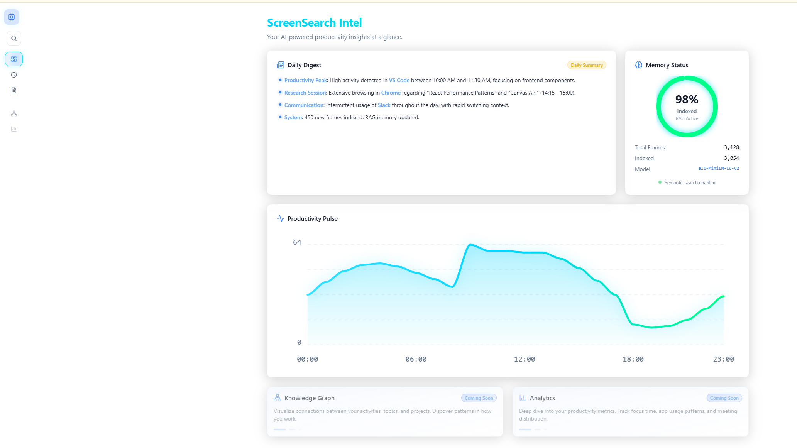
  <p><em>Modern warm-paper aesthetic with sharp edges, solid rule lines, and elegant editorial typography</em></p>
</div>

<br/>

<div align="center">
  <h3>Dark Theme — Comfortable Dark Paper Theme</h3>
  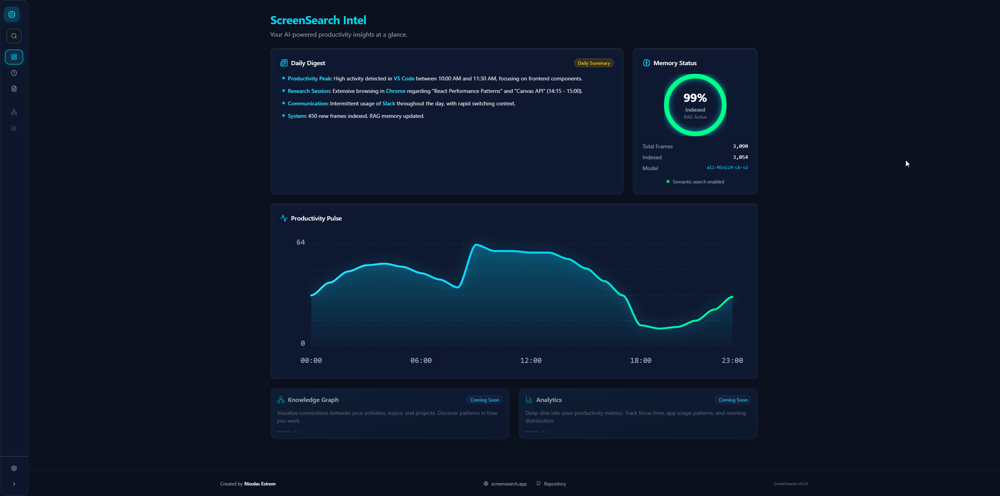
  <p><em>Beautiful dark paper variant for comfortable late-night focus sessions</em></p>
</div>

---

```
┌─────────────────────────────────────────────────────────────────┐
│                        KEY FEATURES                             │
└─────────────────────────────────────────────────────────────────┘
```

- [*] **Editorial Brutalist UI** — Premium Minimalist "Paper & Ink" design system with light and dark mode, sharp edges, and elegant typography
- [*] **AI-First Dashboard** — "Intel Dash" with Daily Digest, Memory Status gauge, and Productivity Pulse charts
- [*] **Continuous Screen Capture** — Configurable intervals (2-5 seconds) with multi-monitor support
- [*] **OCR Text Extraction** — PP-OCRv5 with confidence, language, orientation, bounding boxes, and Windows OCR fallback
- [*] **AI-Powered Intelligence** — Generate insights from your screen history using local LLMs (Ollama, LM Studio) or cloud providers (OpenAI)
- [*] **Hybrid Search** — Fuses FTS5 and sqlite-vec retrieval with Qwen3 reranking
- [*] **Smart Search** — Conversational AI answers with context from your screen history
- [*] **REST API** — 27 endpoints for search, automation, and tag management on localhost:3131
- [*] **UI Automation** — Programmatic control of Windows applications via accessibility APIs
- [*] **System Tray** — unobtrusive background operation with quick access menu
- [*] **Privacy Controls** — Exclude sensitive applications, pause on screen lock
- [*] **High Performance** — Optimized for modern multi-core processors with < 100ms API response times

---

```
┌─────────────────────────────────────────────────────────────────┐
│                    PROJECT INFORMATION                          │
└─────────────────────────────────────────────────────────────────┘
```

- **Website**: [screensearch.app](https://screensearch.app)
- **Repository**: [github.com/nicolasestrem/screensearch](https://github.com/nicolasestrem/screensearch)
- **Author**: Nicolas Estrem
- **License**: MIT
- **Platform**: Windows 10/11 only

---

```
┌─────────────────────────────────────────────────────────────────┐
│                     FEATURE HIGHLIGHTS                          │
└─────────────────────────────────────────────────────────────────┘
```

### [>] AI-First Dashboard — Your Intelligent Command Center

The new **"Intel Dash"** puts AI-powered insights front and center with a premium editorial paper layout. See your day at a glance with auto-generated summaries, RAG indexing progress, and hourly activity charts.

**Dashboard Features:**
- [*] **Daily Digest** — Auto-generated AI summaries of your screen activity
- [*] **Memory Status** — Circular gauge showing semantic search readiness
- [*] **Productivity Pulse** — Interactive hourly activity chart with smooth curves
- [*] **Smart Answers** — Get AI-powered context from your screen history

<div align="center">
  
  <p><em>Your day at a glance: Auto-generated AI summaries, RAG indexing progress, and hourly activity charts</em></p>
</div>

### [>] Smart Search — AI That Understands Context

Ask natural language questions and get AI-powered answers grounded in your actual screen activity.

<div align="center">
  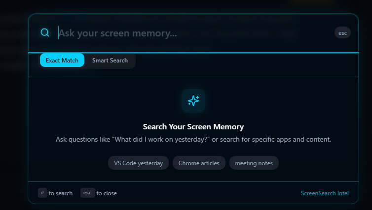
  <p><em>Conversational AI answers with application breakdown and confidence scoring</em></p>
</div>

<div align="center">
  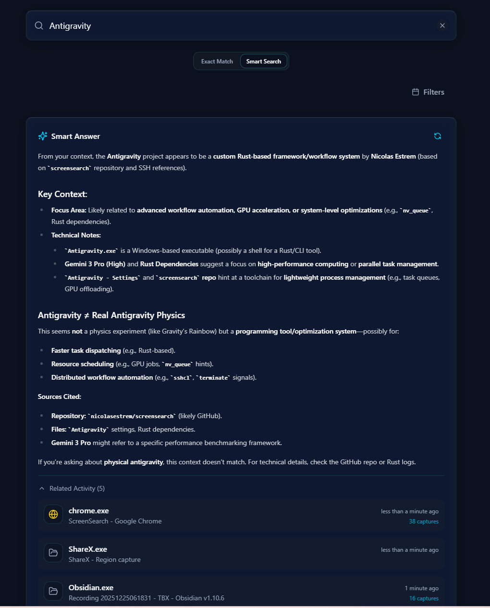
  <p><em>Semantic search understands context—searching for 'Antigravity' finds related workflow automation projects</em></p>
</div>

**Search Features:**
- [*] Natural language queries (e.g., "What was I working on at 3pm yesterday?")
- [*] Hybrid search combining FTS5 keyword matching + vector semantic similarity
- [*] Activity breakdown by application with visual distribution
- [*] Smart Answer Card with AI-generated summaries

### [>] Intelligence Dashboard — AI That Understands Your Work

Transform raw screen captures into actionable insights. The Intelligence dashboard connects to your choice of AI provider—local models like Ollama and LM Studio for privacy, or cloud services like OpenAI for power.

**What It Does:**
- [*] **Daily & Weekly Reports** — Automatic summaries of your work patterns and productivity
- [*] **Custom Queries** — Ask specific questions about your activity history
- [*] **Provider Flexibility** — Works with any OpenAI-compatible API endpoint
- [*] **Privacy First** — Local LLMs keep all analysis on your machine

<div align="center">
  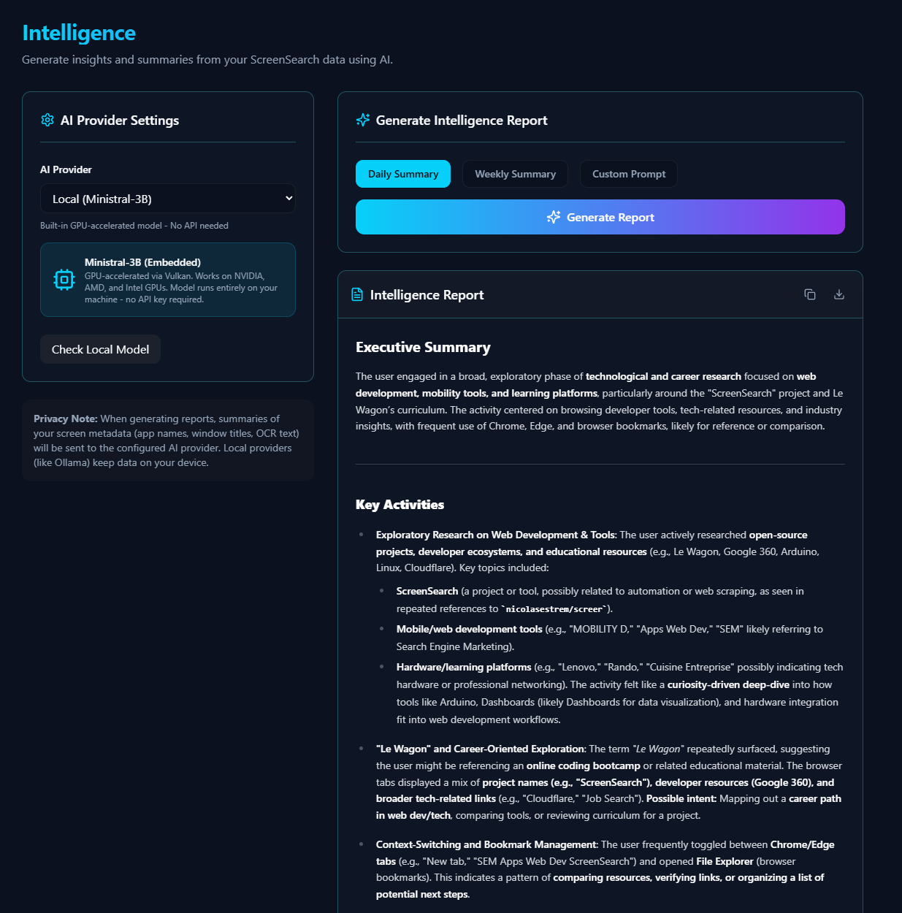
  <p><em>Connect to any OpenAI-compatible API, validate connection, and customize report prompts</em></p>
</div>

<div align="center">
  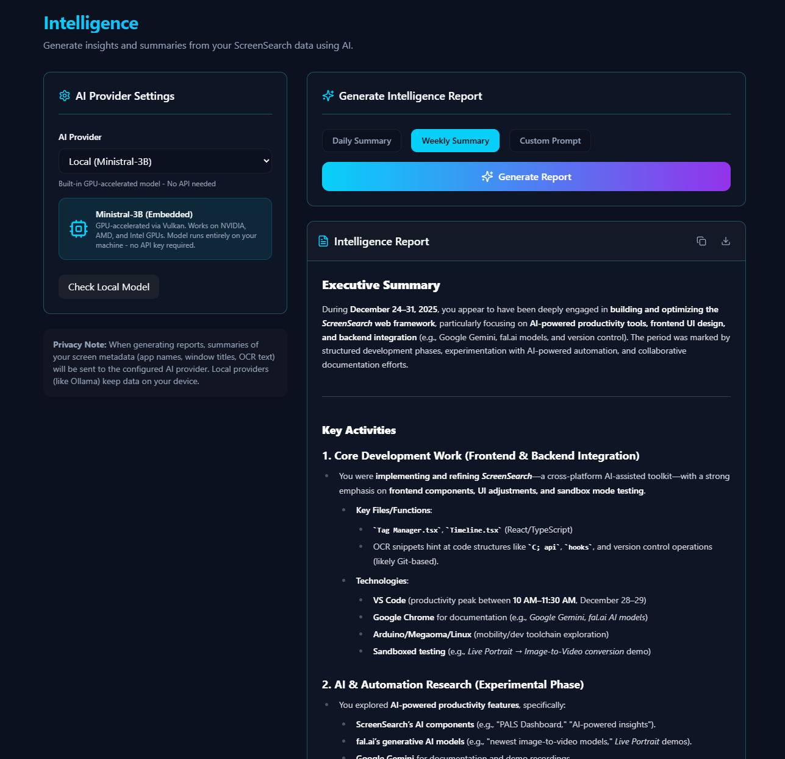
  <p><em>Comprehensive AI analysis with daily summaries, productivity patterns, and actionable recommendations</em></p>
</div>

### [>] Settings & Privacy — Complete Control

Fine-tune every aspect of ScreenSearch with comprehensive, intuitive settings panels.

#### General Settings
<div align="center">
  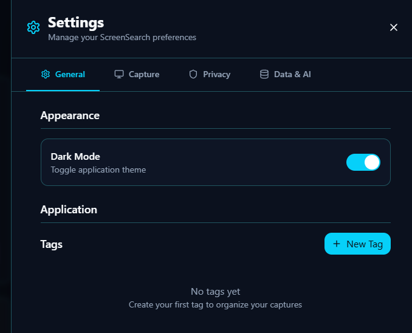
  <p><em>Choose your theme, configure startup behavior, and manage general preferences</em></p>
</div>

#### Capture Configuration
<div align="center">
  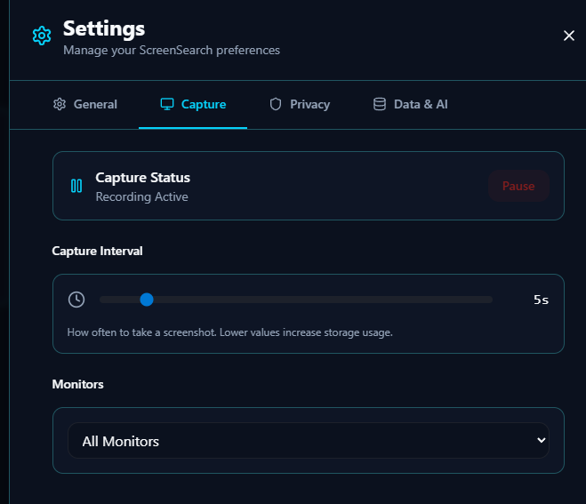
  <p><em>Set capture intervals (2-5 seconds), enable intelligent frame differencing, optimize storage with JPEG compression</em></p>
</div>

#### Privacy Controls
<div align="center">
  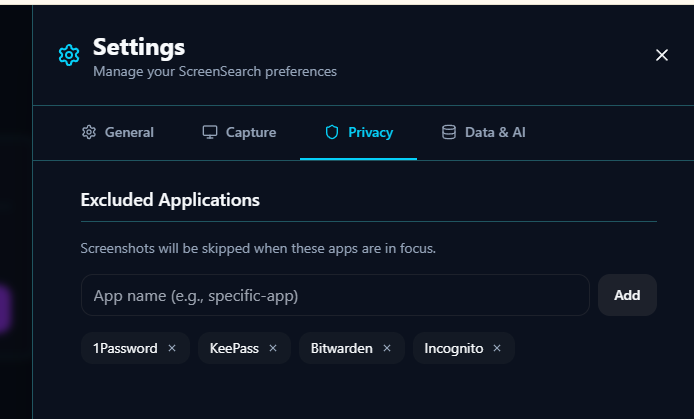
  <p><em>Exclude sensitive apps (1Password, KeePass, banking), auto-pause on screen lock, configure data retention</em></p>
</div>

#### AI Provider Configuration
<div align="center">
  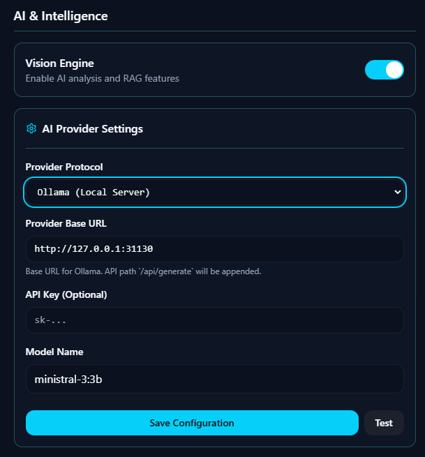
  <p><em>Connect to local LLMs (Ollama, LM Studio) or cloud providers (OpenAI) with real-time API validation</em></p>
</div>

#### Embeddings & Semantic Search
<div align="center">
  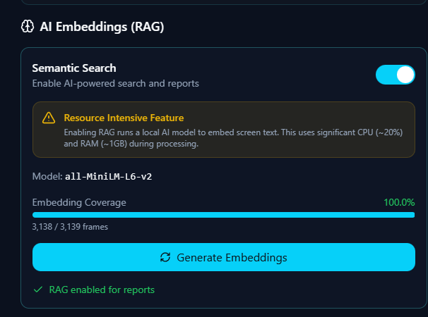
  <p><em>Run local Qwen3 embeddings and reranking through the managed quality sidecar, with explicit health and reindex status</em></p>
</div>

#### Data Management
<div align="center">
  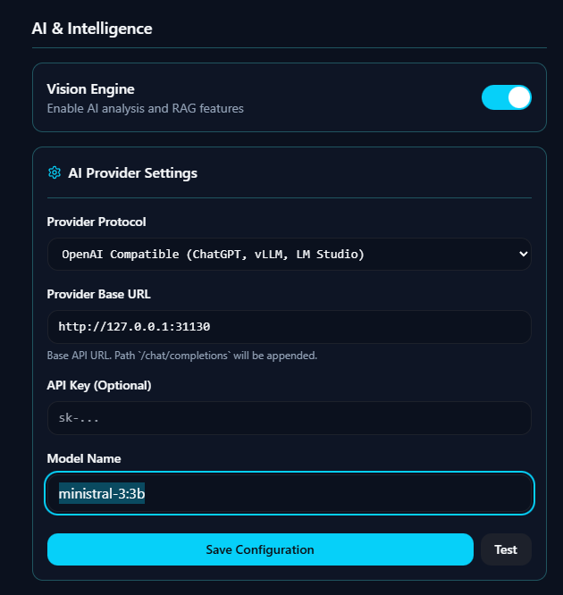
  <p><em>Monitor database size, configure automatic cleanup (retention days), manage storage usage</em></p>
</div>

### [>] See It In Action — Dashboard Demo

Watch the new Intel Dash come to life with smooth animations, real-time updates, and a clean minimalist print interface.

<div align="center">
  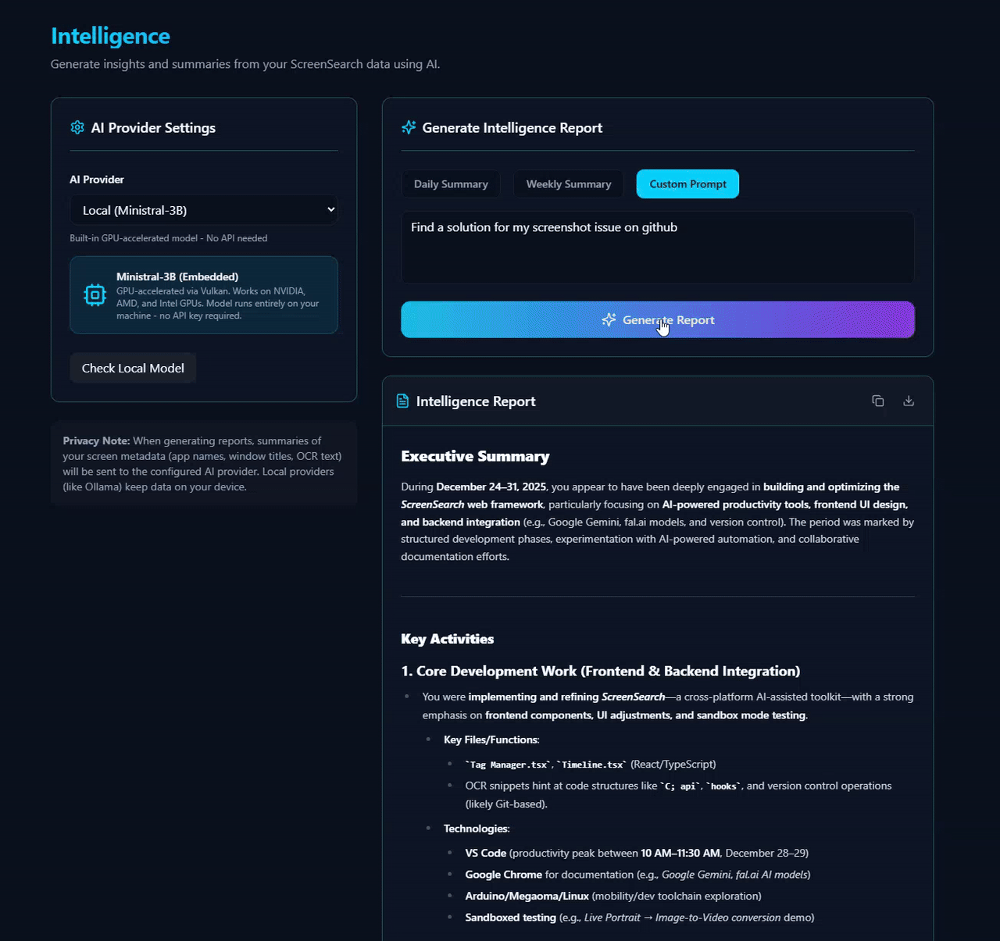
  <p><em>Live dashboard with AI summaries, Memory Status gauge, and Productivity Pulse animations</em></p>
</div>

> **Note**: GIF optimized for GitHub (10fps, 1280px). [Download full HD video](screenshots/demo-dashboard.mp4) for best quality.

### [>] Terminal Integration

Powerful logging and diagnostics. Watch ScreenSearch initialize, start capture loops, and process OCR in real-time with detailed performance metrics and system health checks.

---

```
┌─────────────────────────────────────────────────────────────────┐
│                        QUICK START                              │
└─────────────────────────────────────────────────────────────────┘
```

### Prerequisites

- **Windows 10/11** — Production platform for capture, automation, and the Windows OCR fallback
- **Up to 5 GB free disk space** — PP-OCRv5 and Qwen model preparation
- **Rust 1.70+** — Install from [rustup.rs](https://rustup.rs/)
- **Visual Studio Build Tools** — Required for native compilation ([download](https://visualstudio.microsoft.com/downloads/))
- **Node.js 22+** — Required to rebuild the embedded dashboard
- **Python 3.12** — Required only when building the quality sidecar from source

### Installation & Setup

#### Native Windows Build

```bash
# Clone the repository
git clone https://github.com/nicolasestrem/screensearch.git
cd screensearch

# Build the native Linux development bundle, including the AI sidecar
./scripts/build-local.sh --release

# Run the assembled Linux app (starts API on localhost:3131)
./target/release/screensearch-local/screensearch
```

The Linux bundle is for development. Windows releases are prepared from Linux
with `./scripts/build-release.sh <version>` and packaged by the Windows GitHub
Actions runner after the version tag is published.

After launching a bundled build, use **Settings > Data & AI > Download /
verify** before enabling indexing. This warms the serialized PP-OCRv5, Qwen3
embedding, and Qwen3 reranking loaders and avoids first-request model download
latency.

#### Cross-Compilation from Linux

You can build Windows binaries from Linux using `cargo-xwin`:

```bash
# Install cross-compilation tools (one-time setup)
cargo install cargo-xwin
rustup target add x86_64-pc-windows-msvc
sudo apt-get install -y clang lld llvm  # Ubuntu/Debian

# Validate and build the Windows executable from Linux
./scripts/build-release.sh 0.4.35

# Binary will be at: target/x86_64-pc-windows-msvc/release/screensearch.exe
```

**Note**: Cross-compiled binaries require Windows to run. This is for building on Linux, not running on Linux. See [docs/cross-compilation.md](docs/cross-compilation.md) for detailed instructions.

### [>] Web Dashboard

Launch the beautiful web interface to visualize and manage your captures:

```bash
cd screensearch-ui
npm ci
npm run dev
# Open http://localhost:5173 in your browser
```

**Dashboard Features**:
- [*] **Minimalist Editorial Visuals**: Warm paper and deep ink layouts with crisp rule borders, sharp corners, and editorial typography
- [*] Timeline view of captured frames with real-time thumbnails
- [*] Full-text search across all OCR content
- [*] Intelligence tab with AI-powered report generation
- [*] Frame details with OCR text, tags, and metadata
- [*] Live settings configuration and privacy controls
- [*] Dark mode for comfortable late-night browsing

---

```
┌─────────────────────────────────────────────────────────────────┐
│                      SECURITY & TRUST                           │
└─────────────────────────────────────────────────────────────────┘
```

### Windows SmartScreen Warning

On first launch, Windows may display a SmartScreen warning:
> "Windows protected your PC - Unknown publisher"

**This is expected behavior** because the executable is not code-signed with a certificate (which requires an expensive annual subscription).

**To run the application:**
1. Click **"More info"**
2. Click **"Run anyway"**

### Binary Verification

You can verify the safety of the binary:

- **VirusTotal Scans:**
  - [EXE Scan Results](https://www.virustotal.com/gui/file/807707d80a0886dd635e8cfbcb96d8670c2531176d248206decd248c00961eb0/detection) - 0/72 detections [OK]
  - [ZIP Scan Results](https://www.virustotal.com/gui/file/6b3c93398cf3c720da3e9c88a58bce93e9a9ee016819a9ab26005ef6bde90003) - 0/68 detections [OK]
- **Open Source:** All source code is available in this repository for review
- **Build From Source:** Follow the [Developer Guide](docs/developer-guide.md) to compile yourself

---

```
┌─────────────────────────────────────────────────────────────────┐
│                       DOCUMENTATION                             │
└─────────────────────────────────────────────────────────────────┘
```

| Document | Purpose |
|----------|---------|
| [User Guide](docs/user-guide.md) | Installation, configuration, and everyday usage |
| [Developer Guide](docs/developer-guide.md) | Development setup, workflow, and contribution guidelines |
| [Architecture](docs/architecture.md) | System design, data flow, and technical decisions |
| [API Reference](docs/api-reference.md) | Complete REST API endpoint documentation with examples |
| [Commands Summary](docs/commands-summary.md) | Quick reference for CLI commands and workflows |
| [Testing](docs/testing.md) | Test protocols, coverage reports, and CI/CD pipelines |

```
┌─────────────────────────────────────────────────────────────────┐
│                     PROJECT STRUCTURE                           │
└─────────────────────────────────────────────────────────────────┘
```

```
screensearch/
├── src/main.rs                 # Application entry point and orchestration
├── screensearch-capture/       # Capture, PP-OCR client, Windows fallback
├── screensearch-db/            # SQLite, FTS5, sqlite-vec, migrations
├── screensearch-embeddings/    # Qwen sidecar client and model contract
├── screensearch-api/           # REST API server (Axum framework)
│   ├── src/routes.rs          # API endpoint definitions
│   └── src/handlers/          # Search, embeddings, RAG, generation
├── screensearch-automation/    # Windows UI automation engine
├── sidecar/                    # PP-OCRv5 and Qwen3 inference service
├── evaluation/                 # Versioned retrieval quality cases
├── screensearch-ui/            # Modern React web dashboard
│   ├── src/components/        # UI components (Timeline, Search, Settings)
│   ├── src/pages/             # Main pages (Intelligence, Timeline)
│   └── src/api/               # Frontend API client (including AI endpoints)
├── screenshots/                # README screenshots
├── docs/                       # Complete documentation
└── config.toml                 # Configuration and build settings
```

---

```
┌─────────────────────────────────────────────────────────────────┐
│                    PERFORMANCE METRICS                          │
└─────────────────────────────────────────────────────────────────┘
```

ScreenSearch is optimized for efficiency and speed:

| Metric | Target | Actual | Status |
|--------|--------|--------|--------|
| **OCR Processing** | < 100 ms | **70-80 ms** | [OK] Fast |
| **API Response** | < 100 ms | ~50 ms | [OK] 2x faster |
| **Vector Search** | Dataset-dependent | sqlite-vec KNN + Qwen reranking | Evaluate locally |
| **Test Coverage** | 100% | 59/59 passing | [OK] Complete |

### Recent Performance Optimizations

**[+] Zero-Copy OCR Pipeline** — Direct `SoftwareBitmap` creation eliminates PNG encoding/decoding overhead, saving **60-93ms per frame** (53% faster). Enables 1-second capture intervals.

**[+] Memory Efficiency** — Arc-based frame differencing eliminates redundant allocations, reducing memory pressure from **39GB/8hr → <1GB/8hr**.

**[+] Storage Optimization** — 50x reducution in storage usage via smart JPEG compression and resizing. Automatic 24h cleanup loop enforces retention policies.

**[+] Search Security** — FTS5 query sanitization prevents injection attacks while correctly handling special characters (`C++`, `$100`, etc.).

**[+] Persistent Vector Search** — sqlite-vec performs KNN retrieval without loading every embedding into Rust memory. Reciprocal Rank Fusion combines lexical and semantic candidates before Qwen3 reranking.

See [AI Quality Stack](docs/ai-quality-stack.md) for model sizes, fallback behavior, evaluation, and packaging details.

---

```
┌─────────────────────────────────────────────────────────────────┐
│                    API QUICK EXAMPLES                           │
└─────────────────────────────────────────────────────────────────┘
```

### Search Your Screen History

```bash
# Search for any text captured on your screen
curl "http://localhost:3131/api/search/?q=meeting&mode=hybrid&limit=10"

# Search with filters (timestamp, application name, etc.)
curl "http://localhost:3131/api/search/?q=meeting&app=Chrome&start_time=2026-06-14T00:00:00Z"
```

### Generate AI Intelligence Reports

```bash
# Test your AI provider connection
curl -X POST http://localhost:3131/api/ai/validate \
  -H "Content-Type: application/json" \
  -d '{"provider_url":"http://localhost:11434/v1","model":"llama3"}'

# Generate a daily activity summary
curl -X POST http://localhost:3131/api/ai/generate \
  -H "Content-Type: application/json" \
  -d '{
    "provider_url": "http://localhost:11434/v1",
    "model": "llama3",
    "start_time": "2026-06-14T00:00:00Z",
    "end_time": "2026-06-15T00:00:00Z",
    "prompt": "Summarize my work activity"
  }'
```

### Automate Desktop Interactions

```bash
# Click at specific coordinates
curl -X POST http://localhost:3131/api/automation/click \
  -H "Content-Type: application/json" \
  -d '{"x":100,"y":200,"button":"left"}'

# Type text programmatically
curl -X POST http://localhost:3131/api/automation/type \
  -H "Content-Type: application/json" \
  -d '{"text":"Hello, World!"}'

# Find UI elements by accessibility patterns
curl -X POST http://localhost:3131/api/automation/find-elements \
  -H "Content-Type: application/json" \
  -d '{"role":"Button","name":"Submit"}'
```

See the [API Reference](docs/api-reference.md) for the current route tree.

---

```
┌─────────────────────────────────────────────────────────────────┐
│                     PRIVACY & SECURITY                          │
└─────────────────────────────────────────────────────────────────┘
```

- [*] **Local-Only Storage** — All data stays on your machine in a local SQLite database
- [*] **Exclude Sensitive Apps** — Automatically skip password managers, banking apps, and any app you specify
- [*] **Pause Anytime** — Pause capture with a single click (pauses on screen lock by default)
- [*] **Auto-Cleanup** — Configurable data retention (set automatic deletion of old captures)
- [*] **FTS5 Security** — Query sanitization prevents operator injection attacks

---

```
┌─────────────────────────────────────────────────────────────────┐
│                       CONTRIBUTING                              │
└─────────────────────────────────────────────────────────────────┘
```

We welcome contributions! Here's how to get started:

1. Fork the repository
2. Create a feature branch (`git checkout -b feature/amazing-feature`)
3. Make your changes and add tests
4. Push to the branch (`git push origin feature/amazing-feature`)
5. Open a Pull Request

See [DEVELOPMENT.md](docs/developer-guide.md) for detailed setup instructions.

---

```
┌─────────────────────────────────────────────────────────────────┐
│                          LICENSE                                │
└─────────────────────────────────────────────────────────────────┘
```

This project is licensed under the **MIT License** — see the [LICENSE](LICENSE) file for details.

---

<div align="center">

**Made with care for Windows users who want to remember everything**

[^ Back to top](#screensearch)

</div>

